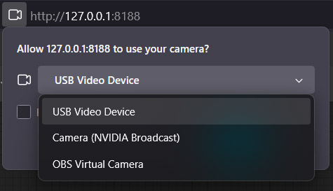
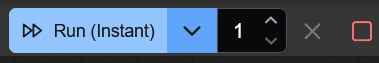

# ComfyUI Virtual Webcam

A Virtual Camera Output For ComfyUI.

On Windows, it will use the OBS Virtual Camera driver. So make sure you have OBS installed.

Then in your other webcam capable applications, such as Google Meet, Teams, Zoom and even OBS itself, you can connect to the `OBS Virtual Camera` option and see what you are outputting from ComfyUI.

## Video Tutorial

[](https://youtu.be/zg-UNTQ4rMw)

## Install ComfyUI Virtual Webcam

To install the custom node `ComfyUI-Virtual-Webcam`, you can use your command/terminal prompt.

1. Navigate to your `ComfyUI/custom_nodes` folder.
2. Run,

```bash
git clone https://github.com/Sean-Bradley/ComfyUI-Virtual-Webcam.git
```

3. Restart ComfyUI

You will find the new Virtual Camera node in the Nodes menu item under SBCODE.

Or you can double click the workspace and search for `virtual`

## How to Use

1. Copy Paste the [basic workflow](#basic-workflow) below into ComfyUI.

2. Select the input webcam. Do not select "OBS Virtual Camera". This will be used as the output later.



3. Select `Run (Instant)` from the drop down.


4. To start, press the `(Run Instant)` button.



5. In your broadcasting or collaboration softwae, select `OBS Virtual Camera` as your webcam input.


6. To Stop, press the red square.


## Basic Workflow

```json
{
  "8": {
    "inputs": {
      "samples": ["31", 0],
      "vae": ["25", 2]
    },
    "class_type": "VAEDecode",
    "_meta": {
      "title": "VAE Decode"
    }
  },
  "10": {
    "inputs": {
      "image": "webcam/1758140880323.png [temp]",
      "width": 480,
      "height": 360,
      "capture_on_queue": true
    },
    "class_type": "WebcamCapture",
    "_meta": {
      "title": "Webcam Capture"
    }
  },
  "13": {
    "inputs": {
      "images": ["18", 0]
    },
    "class_type": "PreviewImage",
    "_meta": {
      "title": "Preview Image"
    }
  },
  "18": {
    "inputs": {
      "fps": 30,
      "continuous": true,
      "stop_stream": false,
      "image": ["8", 0]
    },
    "class_type": "VirtualCamNode",
    "_meta": {
      "title": "Virtual Camera Output"
    }
  },
  "25": {
    "inputs": {
      "ckpt_name": "v1-5-pruned-emaonly-fp16.safetensors"
    },
    "class_type": "CheckpointLoaderSimple",
    "_meta": {
      "title": "Load Checkpoint"
    }
  },
  "26": {
    "inputs": {
      "lora_name": "LCM_LoRA_SD15.safetensors",
      "strength_model": 1,
      "strength_clip": 1,
      "model": ["25", 0],
      "clip": ["25", 1]
    },
    "class_type": "LoraLoader",
    "_meta": {
      "title": "Load LoRA"
    }
  },
  "27": {
    "inputs": {
      "pixels": ["10", 0],
      "vae": ["25", 2]
    },
    "class_type": "VAEEncode",
    "_meta": {
      "title": "VAE Encode"
    }
  },
  "29": {
    "inputs": {
      "text": "alien",
      "clip": ["26", 1]
    },
    "class_type": "CLIPTextEncode",
    "_meta": {
      "title": "CLIP Text Encode (Prompt)"
    }
  },
  "30": {
    "inputs": {
      "text": "text, watermark",
      "clip": ["26", 1]
    },
    "class_type": "CLIPTextEncode",
    "_meta": {
      "title": "CLIP Text Encode (Prompt)"
    }
  },
  "31": {
    "inputs": {
      "seed": 0,
      "steps": 1,
      "cfg": 1,
      "sampler_name": "lcm",
      "scheduler": "sgm_uniform",
      "denoise": 0.5,
      "model": ["26", 0],
      "positive": ["29", 0],
      "negative": ["30", 0],
      "latent_image": ["27", 0]
    },
    "class_type": "KSampler",
    "_meta": {
      "title": "KSampler"
    }
  }
}
```
